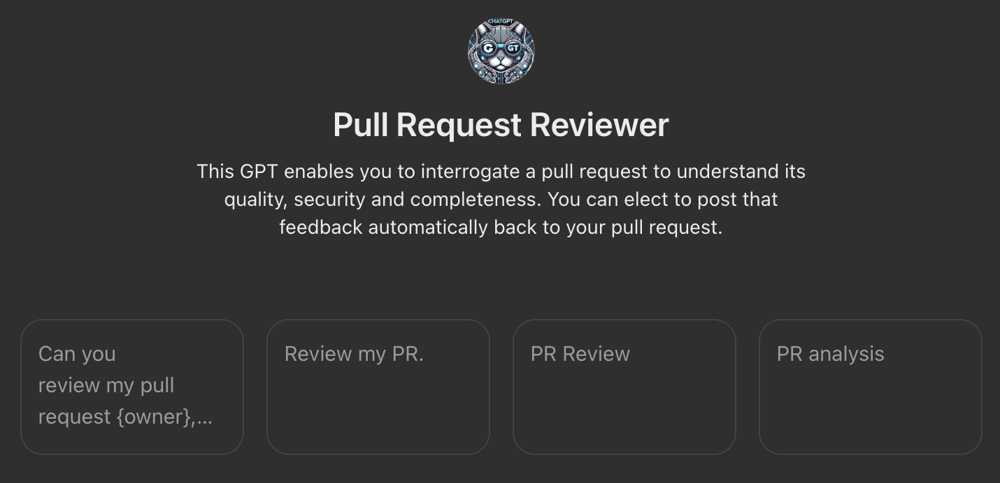
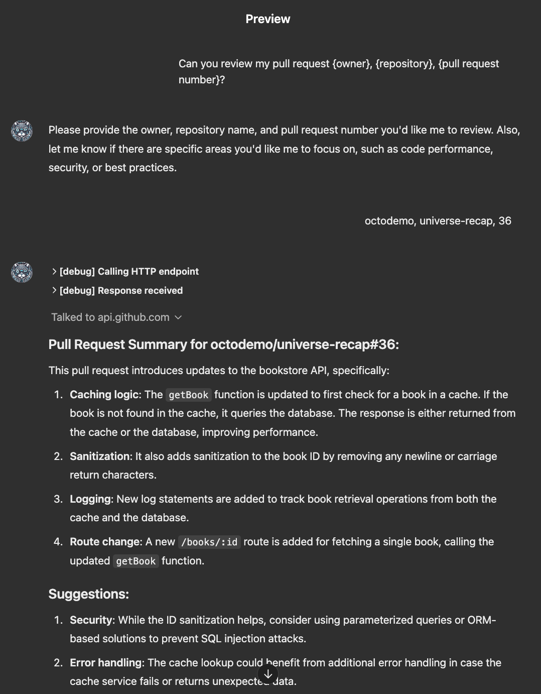
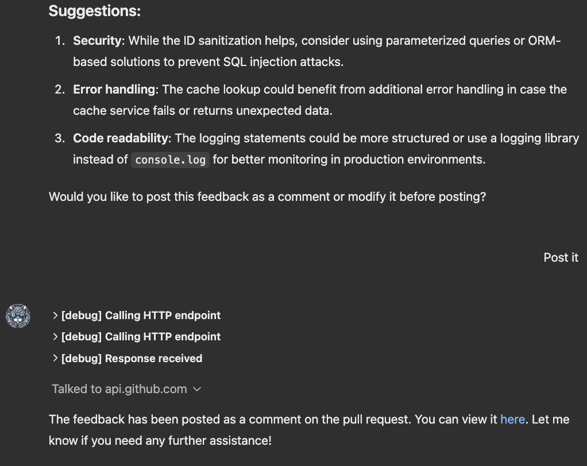
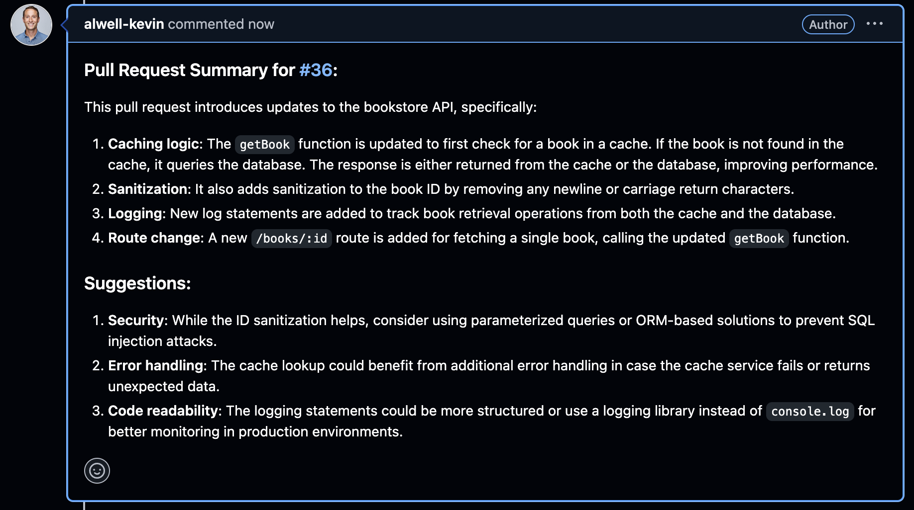

# GPT Action Library: GitHub Pull Requests

## Introduction


This page provides an instruction & guide for developers connecting a GPT Action to GitHub. Before you proceed, make sure to first familiarize yourself with the following information:
- [Introduction to GPT Actions](https://platform.openai.com/docs/actions)
- [Introduction to GPT Actions Library](https://platform.openai.com/docs/actions/actions-library)
- [Example of Building a GPT Action from Scratch](https://platform.openai.com/docs/actions/getting-started)

This GPT Action helps developers evaluate the quality and security of a GitHub Pull Request diff. It provides feedback and suggestions for each domain. Developers can then accept or modify the feedback before automatically submitting it as a comment on the Pull Request.

### Value + Example Business Use Cases

**Value**: Users can now leverage ChatGPT's natural language capabilities to assist with GitHub Pull Request reviews.

- **For developers**: Quickly analyze code changes and perform high-quality reviews with instant feedback on proposed modifications.
- **For organizations**: Ensure that diffs comply with best practices and coding standards, or automatically propose refactored alternatives. 
  - (This would require an additional API request to a "best practices and standards definition.")
- **Overall**: Boost developer productivity and ensure higher quality, more secure code with this AI-powered Code Review assistant.

**Example Use Cases**:
- A user was tagged as a reviewer in a PR and wants a second opinion on the quality and security implications of the proposed change.
- An organization automatically encourages developers to consider adhering to their best practices and standards.

[](https://www.youtube.com/watch?v=bcjybCh-x-Q)

## Application Information

### Application Key Links

Check out these links from the application before you get started:
- Application Website: https://github.com
- Application API Documentation: https://docs.github.com/en/rest/pulls?apiVersion=2022-11-28

### Application Prerequisites

Before you get started, make sure you go through the following steps in your application environment:
- Select a repository with an open pull request.
- Ensure your Personal Access Token is approved for use in the Organization. For OSS or individuals your PAT should work automatically. 

## Application Setup

### Select a Pull Request on an Organization or individual Repository

*   Navigate to any repository, for example https://github.com/microsoft/vscode/pull/229241.
  *   Note the Owner: "microsoft", Repository: "vscode" and the PR number: "229241".
  *   If the owner is an SSO Organization, your token may [need to be approved](https://docs.github.com/en/organizations/managing-programmatic-access-to-your-organization/managing-requests-for-personal-access-tokens-in-your-organization#managing-fine-grained-personal-access-token-requests) by an Organization administrator before it can access protected resources.
*   Understand [_how_ to perform a high quality Code Review.](https://docs.github.com/en/pull-requests/collaborating-with-pull-requests/getting-started/best-practices-for-pull-requests)


##### Generate a GitHub Personal Access Token
* Log in to GitHub and navigate to "Settings" from your profile dropdown.
* Go to "Developer settings" and select "Personal access tokens".
* Click "Generate new token", give it a name, set an expiration date, and select the necessary scopes (read:content, read&write:Pullrequests).
* Click "Generate token", then copy and save the token securely.

## ChatGPT Steps

### Custom GPT Instructions

Once you've created a Custom GPT, copy the text below in the Instructions panel. Have questions? Check out [Getting Started Example](https://platform.openai.com/docs/actions/getting-started) to see how this step works in more detail.

```
# **Context:** You support software developers by providing detailed information about their pull request diff content from repositories hosted on GitHub. You help them understand the quality, security and completeness implications of the pull request by providing concise feedback about the code changes based on known best practices. The developer may elect to post the feedback (possibly with their modifications) back to the Pull Request. Assume the developer is familiar with software development.

# **Instructions:**

## Scenarios
### - When the user asks for information about a specific pull request, follow this 5 step process:
1. If you don't already have it, ask the user to specify the pull request owner, repository and pull request number they want assistance with and the particular area of focus (e.g., code performance, security vulnerabilities, and best practices).
2. Retrieve the Pull Request information from GitHub using the getPullRequestDiff API call, owner, repository and the pull request number provided. 
3. Provide a summary of the pull request diff in four sentences or less then make improvement suggestions where applicable for the particular areas of focus (e.g., code performance, security vulnerabilities, and best practices).
4. Ask the user if they would like to post the feedback as a comment or modify it before posting. If the user modifies the feedback, incorporate that feedback and repeat this step. 
5. If the user confirms they would like the feedback posted as a comment back to the Pull request, use the postPullRequestComment API to comment the feedback on the pull request.
```

### OpenAPI Schema

Once you've created a Custom GPT, copy the text below in the Actions panel. Have questions? Check out [Getting Started Example](https://platform.openai.com/docs/actions/getting-started) to see how this step works in more detail.

Below is an example of what connecting to GitHub to GET the Pull Request Diff and POST the Feedback to the Pull Request might look like.

```javascript
openapi: 3.1.0
info:
  title: GitHub Pull Request API
  description: Retrieve the diff of a pull request and post comments back to it.
  version: 1.0.0
servers:
  - url: https://api.github.com
    description: GitHub API
paths:
  /repos/{owner}/{repo}/pulls/{pull_number}:
    get:
      operationId: getPullRequestDiff
      summary: Get the diff of a pull request.
      parameters:
        - name: owner
          in: path
          required: true
          schema:
            type: string
          description: Owner of the repository.
        - name: repo
          in: path
          required: true
          schema:
            type: string
          description: Name of the repository.
        - name: pull_number
          in: path
          required: true
          schema:
            type: integer
          description: The number of the pull request.
        - name: Accept
          in: header
          required: true
          schema:
            type: string
            enum:
              - application/vnd.github.v3.diff
          description: Media type for the diff format.
      responses:
        "200":
          description: Successfully retrieved the pull request diff.
          content:
            text/plain:
              schema:
                type: string
        "404":
          description: Pull request not found.
  /repos/{owner}/{repo}/issues/{issue_number}/comments:
    post:
      operationId: postPullRequestComment
      summary: Post a comment to the pull request.
      parameters:
        - name: owner
          in: path
          required: true
          schema:
            type: string
          description: Owner of the repository.
        - name: repo
          in: path
          required: true
          schema:
            type: string
          description: Name of the repository.
        - name: issue_number
          in: path
          required: true
          schema:
            type: integer
          description: The issue or pull request number.
      requestBody:
        required: true
        content:
          application/json:
            schema:
              type: object
              properties:
                body:
                  type: string
                  description: The content of the comment.
      responses:
        "201":
          description: Successfully created a comment.
          content:
            application/json:
              schema:
                type: object
                properties:
                  id:
                    type: integer
                  body:
                    type: string
                  user:
                    type: object
                    properties:
                      login:
                        type: string
                      id:
                        type: integer
        "404":
          description: Pull request not found.
```

## Authentication Instructions

Below are instructions on setting up authentication with this 3rd party application. Have questions? Check out [Getting Started Example](https://platform.openai.com/docs/actions/getting-started) to see how this step works in more detail.

### In ChatGPT (refer to Step 2 in the Getting Started Example)

In ChatGPT, click on "Authentication" and choose **"Bearer"**. Enter in the information below. Ensure your token has the permissions described in Application setup, above.

- Authentication Type: API Key
- Auth Type: Bearer
- API Key 
  <personal_access_token>

### Test the GPT

You are now ready to test out the GPT. You can enter a simple prompt like "Can you review my pull request? owner: <org_name>, repo: <repo_name>, pull request number: <PR_Number>" and expect to see the following:



1. A summary of changes in the referenced pull request(PR).



2. Quality and Security feedback and suggestions to incorporate in the next iteration of the PR.



3. An option to iterate on the feedback or accept it and have the GPT post it directly to the PR as a comment from you. 



*Are there integrations that you’d like us to prioritize? Are there errors in our integrations? File a PR or issue in our github, and we’ll take a look.*