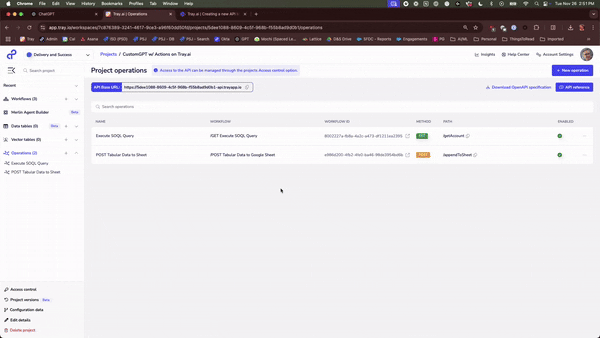
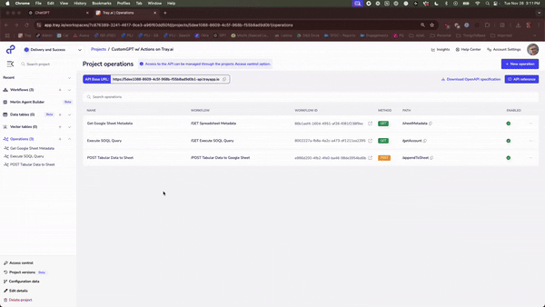

# GPT Action Library: Tray.ai API Management Operations

## Introduction

This page provides an instruction & guide for developers building a set of GPT Actions across a set of applications. Before you proceed, make sure to first familiarize yourself with the following information: 
- [Introduction to GPT Actions](https://platform.openai.com/docs/actions)
- [Introduction to GPT Actions Library](https://platform.openai.com/docs/actions/actions-library)
- [Example of Building a GPT Action from Scratch](https://platform.openai.com/docs/actions/getting-started)

This particular GPT Action(s) provides an overview of how to connect to a **Tray.ai API Management Operations**. 

### Value + Example Business Use Cases

**Value**: Users can now leverage ChatGPT's natural language capability to connect directly to APIs created through API Management in Tray.ai

**Example Use Cases**: 
- Tray.ai is a middleware that composes workflows, handles workflow execution and scaling, and interfaces with hundreds of 3rd party applications
- You have a custom operation running in Tray.ai workflow(s) that you'd like to incorporate into a GPT. 
- You would like to govern access to actions for your organization/team  under a single API interface

## Application Information

### Application Key Links

Check out these links from the application before you get started:
- Application Website: https://tray.ai/universal-automation-cloud/api-management
- Application API Documentation: https://tray.ai/documentation/tray-uac/api-management/api-management-overview/

### Application Prerequisites

Before you get started, make sure you go through the following steps in your Tray.ai environment:
- Set up a Tray.ai account
- Create a project with a set of simple API Management Operations

### Application Workflow Steps

Below is an example of a building and extending a basic set of API Management operations:\

## ChatGPT Steps

### Custom GPT Instructions 

Once you've created a Custom GPT, you should add Instructions to the GPT providing context about the GPTs role, and the actions it is able to perform. Have questions? Check out [Getting Started Example](https://platform.openai.com/docs/actions/getting-started) to see how this step works in more detail.

### OpenAPI Schema 

Once you've created a Custom GPT, download the API specification from your Tray.ai project, copy the contents, and paste it into your Custom GPT action
schema. Once complete, update the `openapi` version to `3.1.0`.

Below are instructions on setting up authentication with this 3rd party application. Have questions? Check out [Getting Started Example](https://platform.openai.com/docs/actions/getting-started) to see how this step works in more detail.

### Pre-Action Steps

Before you set up authentication in ChatGPT, please take the following steps in the application:
- Create a new role with the name `full`
- Create a new policy specifying name, operations to allow, and policy rules with `"Authentication" == True` and role is `full`
- Create a new client with roles set to `full`
- Save your API Token for future steps

### In ChatGPT

In ChatGPT, click on "Authentication" and choose **"API Key"**. Enter in the information below. 

- **API Key**: (Paste your API Key provided by the Tray.ai API Management Client)
- **Auth Type**: Bearer

### FAQ & Troubleshooting

- *Auth/Forbidden Error:* Ensure you have properly entered your API key and have set the `Auth Type` as `Bearer`.
- *Tray.ai Internal Error:* You can configure responses back to your CustomGPT configuring error handling and responding back with error messages.
